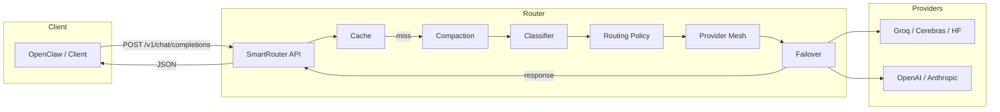

# 🦞 Incrypt Smart Router

<p align="center">
  <strong>Smart AI routing + context compression for OpenClaw</strong><br/>
  One service: route by complexity, compact context, cache responses, auto-failover. Free-first.
</p>

<p align="center">
  <a href="https://github.com/GHX5T-SOL/incrypt_smart_router"></a>
  <a href="https://openclaw.ai"></a>
  <a href="https://nodejs.org"></a>
  <a href="LICENSE"></a>
  <a href="https://incrypt.network"></a>
</p>

---

## 💝 Support the project

We offer this router **free** so you can run OpenClaw agents with minimal or zero paid API cost. If it helps you, consider sending a coffee:

| Network | Address |
|--------|--------|
| **Solana** ☀️ | `iNc3VKxxXmARmp1g4edzRuRNAA31DkGfyMxzkZosguh` |
| **EVM** ⟠ | `0xB78B84EEe2F6CD8b33622fBbD4cCcB1c7009369e` |

**Built by [Incrypt Network](https://incrypt.network)** · [X @incrypt_defi](https://x.com/incrypt_defi) · [incryptinvestments@protonmail.com](mailto:incryptinvestments@protonmail.com)

---

## 📑 Table of contents

| Section | Description |
|--------|--------------|
| [Why Incrypt Smart Router?](#-why-incrypt-smart-router) | The inefficiency trap and why routing + compression + cache in one |
| [What it is](#-what-it-is) | Product overview and how it fits with OpenClaw |
| [Install and use](#-install-and-use) | One-command install + OpenClaw agent instructions |
| [Quick start](#-quick-start) | Run the router in under a minute |
| [How it works](#-how-it-works) | Architecture, pipeline, and technical detail |
| [vs ClawRouter & others](#-vs-clawrouter--claw-compactor--tokenwatch) | Comparison and why use Incrypt Smart Router |
| [Routing tiers](#-routing-tiers) | Simple / standard / complex and provider matrix |
| [API reference](#-api-reference) | HTTP endpoints and request/response shape |
| [Configuration](#-configuration) | Environment variables and tuning |
| [OpenClaw setup](#-openclaw-setup) | Point OpenClaw at the router (config examples) |
| [Development](#-development) | Build, test, and contribute |

---

## 💡 Why Incrypt Smart Router?

If you use [OpenClaw](https://openclaw.ai) (or any single-model API) with a premium model as default, you’re probably overpaying. **Most requests are simple** — autocomplete, explain this error, fix syntax, short Q&A — but they get sent to a $15–25/M-token model. That’s like taking a Ferrari to buy groceries.

**The fix is simple:** send each request to the **cheapest model that can handle it**. Simple tasks → free or low-cost models (Groq, Cerebras, DeepSeek-style). Standard tasks → mid-tier. Only the genuinely hard reasoning needs a premium model.

[ClawRouter](https://github.com/BlockRunAI/ClawRouter) (BlockRun) does exactly that for OpenClaw with 14-dimension scoring and x402/USDC — one wallet, 30+ models, no API keys. [claw-compactor](https://github.com/aeromomo/claw-compactor) slashes token use with 5-layer compression. **Incrypt Smart Router** is a **unified solution**: one service that does **routing + context compression + response caching + fallback**, so you use the right model every time *and* send fewer tokens. You bring your own API keys (start with free-tier keys, add paid when you need them). No wallet, no new accounts — just point OpenClaw at the router and go.

---

## 🎯 What it is

**Incrypt Smart Router** is a **single, production-ready service** that sits between your [OpenClaw](https://openclaw.ai) agents (or any OpenAI-compatible client) and LLM providers. It:

| Capability | What it does |
|------------|--------------|
| **🔄 Smart routing** | Classifies each request (simple / standard / complex) and sends it to the **cheapest capable** model — free tiers first, then low-cost, then premium when you add API keys. |
| **📉 Context compression** | Compacts conversation history **before** sending to the model (rule-based + dictionary + RLE-style), cutting token usage and cost. Inspired by [claw-compactor](https://github.com/aeromomo/claw-compactor). |
| **💾 Caching** | Caches responses by request fingerprint; repeated or near-identical requests are served from cache (configurable TTL and size). |
| **🛡️ Fallback** | If the chosen provider times out or errors, the router automatically tries the next provider in the same tier. |
| **📊 Observability** | Per-request metadata (tier, model, latency, cache hit) and a `/stats` endpoint for dashboards or debugging. |

You get **one HTTP endpoint** (`/v1/chat/completions`) that is **OpenAI-compatible**, so OpenClaw (and other tools) can use it as a drop-in backend. No wallet or x402 required — use your own API keys (or free-tier keys) and scale up by adding keys to `.env`.

---

## 🚀 Install and use

### One-command install (curl)

```bash
curl -fsSL https://raw.githubusercontent.com/GHX5T-SOL/incrypt_smart_router/main/scripts/install.sh | bash
```

This clones the repo (into `~/incrypt_smart_router` by default), runs `npm install`, `npm run build`, and creates `.env` from `.env.example`. Then add at least one API key (see [Quick start](#-quick-start)) and run `npm start`.

### Use with your OpenClaw agent

You can tell your **OpenClaw agent** to install and use the router in natural language, for example:

- *“Install and use https://github.com/GHX5T-SOL/incrypt_smart_router”*
- *“Set up Incrypt Smart Router and use it as my LLM backend”*

The agent can clone the repo, run the install script (or `npm install && npm run build`), create `.env` with your chosen keys, start the router, and then you configure OpenClaw to use `http://localhost:3140/v1/chat/completions` as the chat endpoint (see [OpenClaw setup](#-openclaw-setup)).

---

## ⚡ Quick start

1. **Clone and build**
   ```bash
   git clone https://github.com/GHX5T-SOL/incrypt_smart_router.git
   cd incrypt_smart_router
   npm install && npm run build
   ```

2. **Configure at least one API key**  
   Free tier (no credit card):
   - **Groq**: [console.groq.com](https://console.groq.com) → sign up → API Keys → copy key → set `GROQ_API_KEY` in `.env`.
   - **Cerebras**: [cloud.cerebras.ai](https://cloud.cerebras.ai) (free tier available).
   - **HuggingFace**: [huggingface.co/settings/tokens](https://huggingface.co/settings/tokens) → set `HF_TOKEN` in `.env`.

   ```bash
   cp .env.example .env
   # Edit .env and add, e.g.:
   # GROQ_API_KEY=gsk_...
   ```

3. **Start the router**
   ```bash
   npm start
   ```
   Server listens on **http://localhost:3140**.

4. **Smoke test**
   ```bash
   curl -X POST http://localhost:3140/v1/chat/completions \
     -H "Content-Type: application/json" \
     -d '{"messages":[{"role":"user","content":"Say hello in one word"}]}'
   ```
   You should get a JSON response with `choices[0].message.content` and a `meta` object (tier, model, provider, `cacheHit`, etc.).

5. **Point OpenClaw at the router**  
   In OpenClaw config, add a custom provider with `baseUrl: "http://localhost:3140/v1"` and use that provider’s model as primary (see [OpenClaw setup](#-openclaw-setup)).

---

## 🔧 How it works

### High-level flow

```
┌─────────────────┐     POST /v1/chat/completions      ┌──────────────────────┐
│  OpenClaw /     │ ─────────────────────────────────► │  Incrypt Smart Router │
│  Any client     │                                    │                      │
└─────────────────┘                                    │  1. Cache lookup     │
        ▲                                               │  2. Compaction      │
        │                                               │  3. Classifier      │
        │              JSON response                    │  4. Route by tier   │
        └───────────────────────────────────────────────│  5. Provider call    │
                                                       │  6. Fallback if err  │
                                                       │  7. Cache + telemetry│
                                                       └──────────┬───────────┘
                                                                  │
                                                                  ▼
                                                       ┌──────────────────────┐
                                                       │  LLM providers       │
                                                       │  (Groq, OpenAI,      │
                                                       │   Anthropic, …)      │
                                                       └──────────────────────┘
```

### Pipeline (technical)

1. **Cache gate**  
   Request (messages + options) is hashed. On hit, the cached response is returned with `meta.cacheHit: true`. No compaction or provider call.

2. **Compaction**  
   If compression is enabled, the message list is run through a deterministic pipeline:
   - **Rule-based**: dedupe consecutive identical messages, collapse multiple newlines, strip empty markdown lines, collapse runs of spaces.
   - **Dictionary**: frequent phrases → short codes (e.g. `$00`, `$01`); codebook is not sent to the model (optional; reduces size further).
   - **RLE-style**: path and repetition shortening.  
   This reduces token count before the request is sent to the model.

3. **Classifier**  
   Heuristic complexity (no external API): length, keywords (e.g. “analyze”, “report”, “format”), and thresholds map to **simple**, **standard**, or **complex**.

4. **Routing policy**  
   For the chosen tier, the router selects from configured providers that have an API key in `.env`. **Free-first**: simple tier uses free providers (e.g. Groq, Cerebras, HuggingFace); standard/complex use paid providers when keys are present.

5. **Provider mesh + failover**  
   The router calls the first provider in the tier’s list. On timeout or error, it tries the next in order (same tier). Response is normalized to an OpenAI-shaped structure.

6. **Response and telemetry**  
   Response is cached, and metadata (tier, model, provider, latency, cache hit, token counts) is appended and stored for `/stats`.

### Mermaid architecture



---

## 📊 vs ClawRouter & claw-compactor & TokenWatch

Incrypt Smart Router unifies ideas from [ClawRouter](https://github.com/BlockRunAI/ClawRouter), [claw-compactor](https://github.com/aeromomo/claw-compactor), and [TokenWatch](https://github.com/DN-bit/tokenwatch) in **one service** you host yourself, with **your** API keys.

| Aspect | ClawRouter | claw-compactor | TokenWatch | **Incrypt Smart Router** |
|--------|------------|----------------|------------|---------------------------|
| **Routing** | ✅ 15-dim, 41+ models, x402 | ❌ | ✅ Complexity + rate limits | ✅ 3-tier, free-first, your keys |
| **Compression** | ❌ | ✅ 5 layers (rule, dict, RLE, observe, CCP) | ❌ | ✅ Rule + dictionary + RLE (in-process) |
| **Caching** | ❌ | ❌ | ❌ | ✅ Exact-match cache, TTL, configurable size |
| **Auth / payment** | x402, USDC wallet | N/A | API keys | API keys (free + paid) |
| **OpenClaw** | Plugin, `/model blockrun/auto` | Offline scripts | Proxy | **OpenAI-compatible proxy** (baseUrl) |
| **Deployment** | OpenClaw plugin + BlockRun | Python scripts on workspace | Single Python file | **Single Node service** (one port) |
| **Dashboard** | — | — | ✅ Live dashboard | ✅ `/stats` + telemetry in response |

Use **Incrypt Smart Router** when you want: one process, your own keys, free-first routing, built-in compaction and caching, and a single OpenAI-compatible endpoint for OpenClaw (or other clients). Use **ClawRouter** when you prefer x402/USDC and BlockRun’s model list; use **claw-compactor** for offline, workspace-level compression scripts.

---

## 🎚 Routing tiers

| Tier | Typical tasks | Providers (when key in `.env`) | Notes |
|------|----------------|--------------------------------|-------|
| **Simple** | Short Q&A, formatting, lookups, “what is X” | Groq, Cerebras, HuggingFace, Together | Free-tier keys; lowest cost. |
| **Standard** | Email drafting, summaries, medium-length reasoning | Together, OpenAI (gpt-4o-mini), Anthropic (Haiku), Google (Gemini Flash) | Add `OPENAI_API_KEY`, `ANTHROPIC_API_KEY`, etc. |
| **Complex** | Analysis, reports, coding, deep reasoning | OpenAI (gpt-4o), Anthropic (Sonnet) | Premium models; same keys as above. |

Classification is heuristic (length + keywords). You can override with `forceTier` in the request body (see [API reference](#-api-reference)).

---

## 📡 API reference

Base URL: `http://localhost:3140` (or your host). All responses are JSON.

### `POST /v1/chat/completions`

OpenAI-compatible chat completion.

**Request body**

| Field | Type | Required | Description |
|-------|------|----------|--------------|
| `messages` | `array` | ✅ | Array of `{ role, content }` (system/user/assistant). |
| `model` | `string` | ❌ | Optional; router may override by tier. |
| `max_tokens` | `number` | ❌ | Max completion tokens. |
| `temperature` | `number` | ❌ | Sampling temperature. |
| `stream` | `boolean` | ❌ | **Not supported** — responses are non-streaming only. |
| `forceTier` | `"simple" \| "standard" \| "complex"` | ❌ | Override classifier. |

**Response**

Same shape as OpenAI chat completions, plus a `meta` object:

- `tier`, `model`, `provider`, `cacheHit`, `compressedFromTokens?`, `latencyMs?`, `fallbackUsed?`

### `GET /health`

Liveness. Returns `{ status: "ok", service: "incrypt-smart-router" }`.

### `GET /stats`

Cache size and last 50 requests (tier, model, provider, latency, tokens, cache hit, etc.) for debugging or simple dashboards.

---

## ⚙️ Configuration

Environment variables (e.g. in `.env`):

| Variable | Description | Default |
|----------|-------------|---------|
| `PORT` | HTTP server port | `3140` |
| `COMPRESSION_ENABLED` | Run compaction before calling the model | `true` |
| `CACHE_TTL_SECONDS` | Cache entry TTL | `3600` |
| `CACHE_MAX_SIZE` | Max number of cached responses | `1000` |
| `LOG_LEVEL` | Server log level | `info` |
| `GROQ_API_KEY` | Groq (free tier) | — |
| `CEREBRAS_API_KEY` | Cerebras | — |
| `HF_TOKEN` | HuggingFace | — |
| `TOGETHER_API_KEY` | Together | — |
| `OPENAI_API_KEY` | OpenAI (standard/complex) | — |
| `ANTHROPIC_API_KEY` | Anthropic (standard/complex) | — |
| `GOOGLE_AI_API_KEY` | Google Gemini (adapter not yet implemented) | — |

At least one of the free-tier keys (e.g. `GROQ_API_KEY`) is recommended so the router can serve simple requests without any paid keys.

---

## 🦞 OpenClaw setup

After the router is running, point OpenClaw at it using a **custom model provider** with an OpenAI-compatible base URL.

1. Open your OpenClaw config (e.g. `~/.openclaw/openclaw.json`).

2. Under `models`, add a provider and set the agent’s primary model to use it, for example:

```json5
{
  models: {
    mode: "merge",
    providers: {
      "incrypt-router": {
        baseUrl: "http://localhost:3140/v1",
        api: "openai-responses",
        authHeader: false,
        models: [
          {
            id: "incrypt/auto",
            name: "Incrypt Smart Router (auto)",
            api: "openai-responses",
            reasoning: false,
            input: ["text"],
            cost: { input: 0, output: 0, cacheRead: 0, cacheWrite: 0 },
            contextWindow: 128000,
            maxTokens: 8192,
          },
        ],
      },
    },
  },
  agent: {
    workspace: "~/.openclaw/workspace",
    model: { primary: "incrypt-router/incrypt/auto" },
  },
}
```

3. Restart the gateway: `openclaw gateway restart`.

Now OpenClaw will send chat requests to Incrypt Smart Router, which will compress, classify, route, and cache as described above. For more options (e.g. env-based baseUrl), see [docs/OPENCLAW_INTEGRATION.md](docs/OPENCLAW_INTEGRATION.md).

---

## 🛠 Development

```bash
npm run build       # Build (tsup)
npm run test        # Run tests (vitest)
npm run dev         # Watch build
npm run typecheck   # TypeScript check
```

- **Source**: `src/` (router, compaction, classifier, cache, failover, providers, server).
- **Tests**: `src/**/*.test.ts` (compaction, classifier, cache).
- **Docs**: [docs/OPENCLAW_INTEGRATION.md](docs/OPENCLAW_INTEGRATION.md), [docs/ARCHITECTURE.md](docs/ARCHITECTURE.md).

---

## 📚 References

- [OpenClaw](https://openclaw.ai) — AI agent framework.
- [OpenClaw Gateway Configuration](https://docs.openclaw.ai/gateway/configuration-reference) — Config reference.
- [ClawRouter](https://github.com/BlockRunAI/ClawRouter) — Smart routing for OpenClaw (x402, BlockRun); [“Use OpenClaw? Try ClawRouter to save 70%…”](https://x.com/bc1beat/status/2019555730475610236) (why routing matters).
- [BlockRun Docs](https://blockrun.ai/docs) — ClawRouter and x402.
- [claw-compactor](https://github.com/aeromomo/claw-compactor) — Multi-layer context compression.
- [TokenWatch](https://github.com/DN-bit/tokenwatch) — LLM router with dashboard and rate limits.

---

**License:** MIT · [Incrypt Network](https://incrypt.network)
