# Incrypt Smart Router Prompt Plan

## Objective

Produce a copy-paste Cursor prompt that forces: (1) deep pre-build research, (2) architecture validation, (3) staged implementation from zero repo state, and (4) production-style verification before completion.

## Grounded Starting Point

- Workspace is effectively empty except a minimal `README.md`; this should be treated as greenfield scaffolding.
- Baseline references to integrate conceptually (not by blind copy) include:
  - `ClawRouter` for routing profile ideas and OpenClaw positioning.
  - `claw-compactor` for deterministic multi-layer context compaction.
  - `tokenwatch` for lightweight routing + dashboard patterns.
  - RouteLLM/LiteLLM/GPTCache/OpenRouter patterns for routing, fallback, and caching.

## Recommended Architecture (for the generated prompt to enforce)

```mermaid
flowchart LR
  openClawAgent[OpenClawAgent] --> ingress[SmartRouterAPI]
  ingress --> cacheGate[SemanticAndExactCache]
  cacheGate -->|cacheMiss| compaction[CompactionPipeline]
  compaction --> complexity[ComplexityClassifier]
  complexity --> policy[RoutingPolicyEngine]
  policy --> providerMesh[ProviderGatewayMesh]
  providerMesh --> failover[RetryAndFallbackChain]
  failover --> response[ResponseNormalizer]
  response --> telemetry[CostLatencyQualityTelemetry]
  response --> openClawAgent
  telemetry --> dashboard[OpsDashboard]
```

## Key Improvements to Require in the Prompt

- Enforce **free-first routing** at launch with explicit graduated tiers when API keys exist in `.env`.
- Require **hybrid compression** (deterministic compaction first, optional query-aware compression for very long contexts).
- Require **semantic + exact caching** with configurable similarity thresholds and TTL.
- Require **provider and model fallback trees** (timeouts, rate limits, context-window errors, moderation failures).
- Require **license/compliance gate** before importing or vendoring external code.
- Require **observable SLOs**: latency, fallback rate, cache hit rate, token savings, and cost/request.
- Require **OpenClaw-native integration path** (plugin hooks) and optional external proxy mode.

## Prompt Deliverable Structure

The final prompt provided to the user should include:

- Role and mission statement.
- Non-negotiable constraints (plan mode first, research-first, no fake claims).
- A phased execution workflow:
  1. discovery + repo/code research,
  2. architecture and tradeoff doc,
  3. scaffold and core implementation,
  4. integrations and failover,
  5. tests/evals/benchmarks,
  6. docs and polished README.
- Explicit acceptance criteria and verification commands per phase.
- Required outputs: architecture doc, implementation plan, working code, tests, benchmark report, and premium README with donation addresses.

## Dependency and Tooling Strategy to Encode

- Prefer stable core stack first (router core + caching + fallback + tests).
- Treat many requested external repos/tools as **optional accelerators**; install only if they satisfy utility and licensing checks.
- Force a “must justify” rule for every added dependency.

## Risks and Mitigations to Encode

- Compression lossiness risk → add fidelity tests and “critical fact retention” checks.
- Router misclassification risk → require benchmark dataset and threshold tuning.
- Provider instability risk → chaos/fault-injection tests for fallback path.
- Scope explosion risk → strict phase gates and stop-for-approval checkpoints.

## Final Outputs for User

- One **exact long-form Cursor master prompt**.
- One **shorter variant** optimized for quick restarts.
- A suggested model/provider default matrix for free-first launch and paid scale-up.
- Suggested README placement for Solana/EVM donation addresses and project branding.

